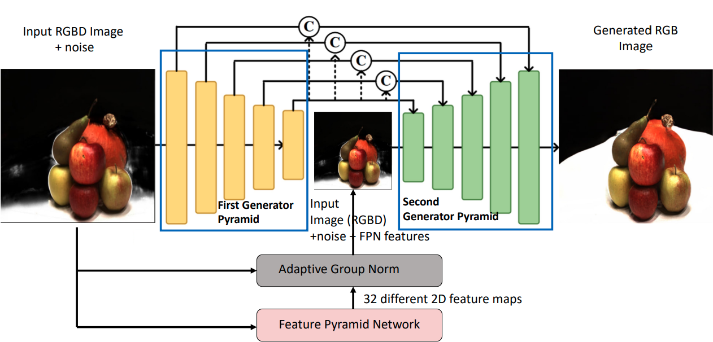

# EnhanceVolRecon

> Code of the paper 'Dual Pyramid Generative Adversarial Networks for Enhancing Room-Scale Scene Reconstruction' (CVPR 2024)

### [Project](https://project_website.github.io/EnhanceVolRecon/) | [arXiv](https://arxiv.org/abs/link_to_paper) 



>**Abstract:** Building on the success of VolRecon, a novel generalizable implicit reconstruction method, we present an extension that employs dual pyramid Generative Adversarial Networks (GANs) to improve the quality of the reconstruction output. By addressing the presence of noise in the output of VolRecon, we enhance the images while preserving semantic information, resulting in a more accurate representation of room-scale scenes.

If you find this project useful for your research, please cite: 

@misc{author2024enhancevolrecon,
title={Dual Pyramid Generative Adversarial Networks for Enhancing Room-Scale Scene Reconstruction},
author={Ralev, Radoslav; Walha, Nassim},
journal={CVPR},
year={2024}
}


## Installation

### Requirements

* python 3.8
* CUDA 10.2

```shell
conda create --name enhancevolrecon python=3.8 pip
conda activate enhancevolrecon

pip install -r requirements.txt
```

## Reproducing Sparse View Reconstruction on DTU
Follow the instructions from the VolRecon repository to reproduce the sparse view reconstruction on the DTU dataset. After obtaining the output from VolRecon, you can enhance the result by using our method.

## Training EnhanceVolRecon
To train the GAN, run:
```shell
python train_cgan.py --run_name <run_name> --ckpt_netD <ckptnetD> --ckpt_netG <ckptnetG> 
```

Evaluating on Custom Dataset
After running VolRecon on your custom dataset, you can improve the results by running our enhancement GAN. To do this, run:
```shell
python evaluate_cgan.py --ckpt_netD <ckpt> --ckpt_netG <ckpt> --out <out.csv>
```
## Acknowledgement
Our method is an extension of VolRecon. We thank the authors for their excellent work and for making their code open-source.


